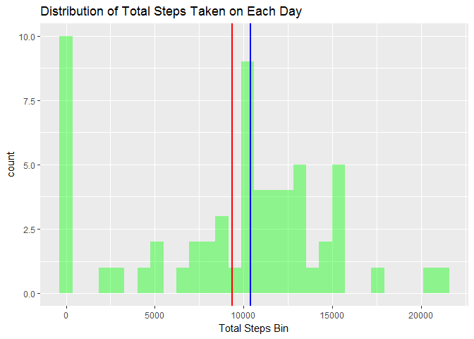
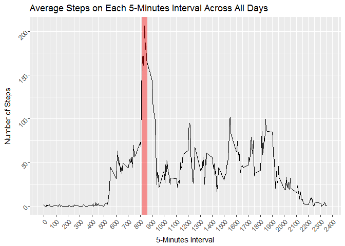
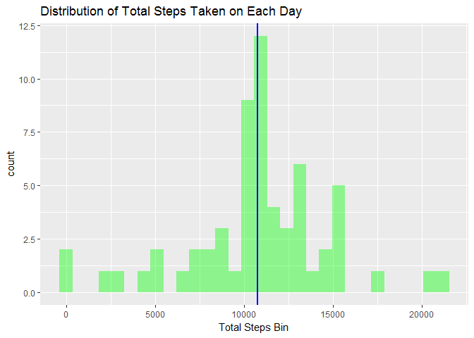
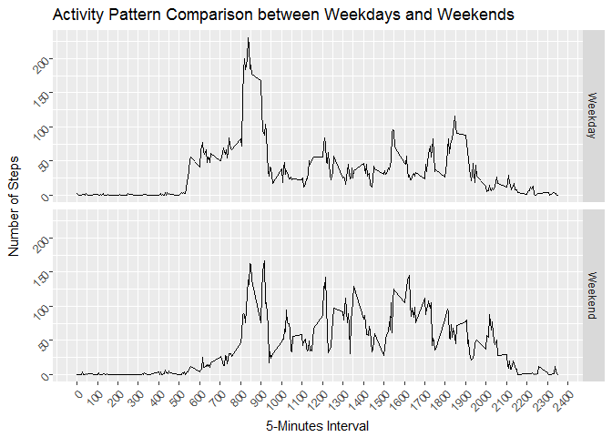

#### *Introduction*

It is now possible to collect a large amount of data about personal
movement using activity monitoring devices such as a Fitbit, Nike
Fuelband, or Jawbone Up. These type of devices are part of the
"quantified self" movement - a group of enthusiasts who take
measurements about themselves regularly to improve their health, to find
patterns in their behavior, or because they are tech geeks. But these
data remain under-utilized both because the raw data are hard to obtain
and there is a lack of statistical methods and software for processing
and interpreting the data.

This assignment makes use of data from a personal activity monitoring
device. This device collects data at 5 minute intervals through out the
day. The data consists of two months of data from an anonymous
individual collected during the months of October and November, 2012 and
include the number of steps taken in 5 minute intervals each day.

The data for this assignment can be downloaded from the course web site:

Dataset: [Activity monitoring
data\[52K\]](https://d396qusza40orc.cloudfront.net/repdata%2Fdata%2Factivity.zip)

Variables included in this dataset are:

-   steps: Number of steps taking in a 5-minute interval (missing values
    are coded as NA)
-   date: The date on which the measurement was taken in YYYY-MM-DD
    format
-   interval: Identifier for the 5-minute interval in which measurement
    was taken

Below are some exploratory analysis and code that does the
plotting/analysis.

#### *Reading and processing data*

    require(ggplot2)
    require(dplyr)
    activity <- tbl_df(read.csv('activity.csv', sep = ','))

#### *What is mean total number of steps taken per day?*

    actiGrouped <- group_by(activity, date) %>% 
        summarise(totalsteps = sum(steps, na.rm = T))

    meanSteps <- mean(actiGrouped$totalsteps, na.rm = T)
    medianSteps <- median(actiGrouped$totalsteps, na.rm = T)

    ggplot(actiGrouped, aes(actiGrouped$totalsteps)) + 
        geom_histogram(fill = 'green',
                       alpha = 0.4) + 
        labs(title = 'Distribution of Total Steps Taken on Each Day') + 
        labs(x = 'Total Steps Bin') + 
        geom_vline(xintercept = mean(actiGrouped$totalsteps, na.rm = T), 
                   color = 'red',
                   lwd = 1) + 
        geom_vline(xintercept = median(actiGrouped$totalsteps, na.rm = T),
                   color = 'blue',
                   lwd = 1)

-   Finding: As the histogram shows, the distribution of total number of
    steps taken per day is about normally distributed.
-   The mean total number of steps, 9354.2295082, is indicated by the
    red vertical line.
-   The median total number of steps, 10395, is indicated by the blue
    vertical line.

#### *What is the average daily activity pattern?*

    actiGrouped <- group_by(activity, interval) %>%
        summarise(meanSteps = mean(steps, na.rm = T))

    interval_max <- actiGrouped$interval[which.max(actiGrouped$meanSteps)]

    ggplot(actiGrouped, aes(interval, meanSteps)) + 
        geom_line() + 
        xlab('5-Minutes Interval') + 
        ylab('Number of Steps') + 
        labs(title = 'Average Steps on Each 5-Minutes Interval Across All Days') + 
        scale_x_continuous(breaks = pretty(actiGrouped$interval, n = 30)) + 
        theme(axis.text = element_text(angle = 45, hjust = 1)) + 
        geom_vline(xintercept = interval_max,
                   color = 'red',
                   lwd = 4,
                   alpha = 0.4)

-   Finding: As the time series plot shows, the interval, 835, indicated
    by the red-shaded area, contains the maximum number of steps across
    all days.

#### *Strategy for imputing missing values*

    numMissing <- nrow(filter(activity, is.na(steps)))
    activitySplit <- split(activity, activity$date)

    for (i in 1:61) {
        if (any(is.na(activitySplit[[i]]$steps))) {
            activitySplit[[i]] <- mutate(activitySplit[[i]], steps = actiGrouped$meanSteps)
        }
    }

    activityNoMissing <- do.call('rbind', activitySplit)

-   Finding: There are 2304 missing values.
-   Missing value imputing strategy: By carefully examining the missing
    part, I found that there were 8 full days of value appeared to be
    missing. I decided to impute missing values with average steps on
    each interval, so this way, the imputed value could have some
    variability.

#### *New histogram for total number of steps taken each day*

    actiGrouped <- group_by(activityNoMissing, date) %>% 
        summarise(totalsteps = sum(steps))

    meanSteps <- mean(actiGrouped$totalsteps, na.rm = T)
    medianSteps <- median(actiGrouped$totalsteps, na.rm = T)

    ggplot(actiGrouped, aes(actiGrouped$totalsteps)) + 
        geom_histogram(fill = 'green',
                       alpha = 0.4) + 
        labs(title = 'Distribution of Total Steps Taken on Each Day') + 
        labs(x = 'Total Steps Bin') + 
        geom_vline(xintercept = mean(actiGrouped$totalsteps, na.rm = T), 
                   color = 'red',
                   lwd = 1) + 
        geom_vline(xintercept = median(actiGrouped$totalsteps, na.rm = T),
                   color = 'blue',
                   lwd = 1)

-   Finding: As we can tell from the new histogram, aftering the missing
    values were imputed, the outlier existed in the old histogram was
    eliminated. On the other hand, the previous histogram was slightly
    skewed. The new histogram, however, is much less skewed, as we can
    see that both the mean vertical line and the median vertical line
    are overlied with each other.
-   The new mean total number of steps per day is: 1.076618910^{4}
-   The new median total number of steps per day is: 1.076618910^{4}

#### *Pattern comparison between weekdays and weekends*

    actiGrouped <- mutate(activityNoMissing, 
                          date = as.Date(date), 
                          weekday = ifelse(weekdays(date) == 'Saturday' | weekdays(date) == 'Sunday', 'Weekend', 'Weekday')) %>%
        group_by(interval, weekday) %>%
        summarise(meanSteps = mean(steps))

    ggplot(actiGrouped, aes(interval, meanSteps)) + 
        geom_line() + 
        xlab('5-Minutes Interval') + 
        ylab('Number of Steps') + 
        labs(title = 'Activity Pattern Comparison between Weekdays and Weekends') + 
        scale_x_continuous(breaks = pretty(actiGrouped$interval, n = 30)) + 
        theme(axis.text = element_text(angle = 45, hjust = 1)) + 
        facet_grid(weekday ~.)

-   Finding: By comparing activity patterns between weekdays and
    weekends, the pattern does not seem to be of too much different.
